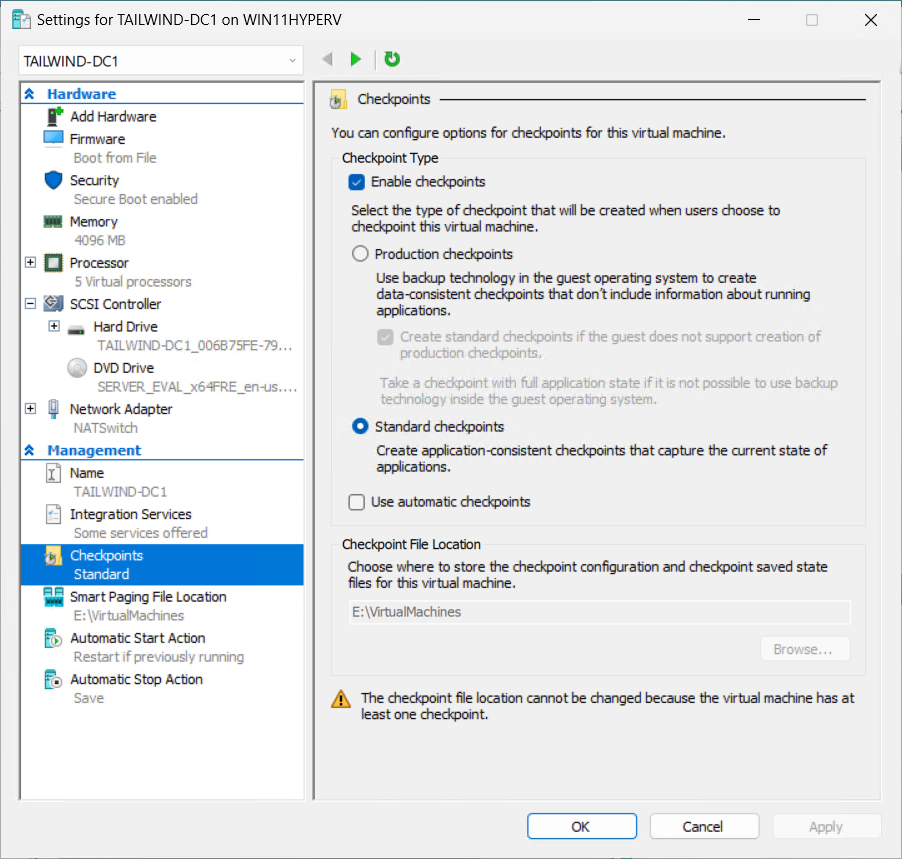

---
lab:
  title: Preparación
  module: Guided Project – Administer Active Directory Domain Services
---
## Información general del proyecto

En este proyecto guiado, se describen los pasos principales para crear, configurar y mantener un controlador de dominio. También tiene la oportunidad de promover un controlador de dominio.

## Configurar

Para reducir los requisitos de acceso a recursos (como el acceso a Windows Server o una suscripción a Microsoft Azure), este proyecto guiado usa una máquina Windows 10 o Windows 11 para ejecutar un entorno virtualizado. Configuras un subsistema de Hyper-V de un equipo con Windows 10 o Windows 11 para admitir las dos máquinas virtuales de Windows Server 2022 Evaluation Edition que usa en este proyecto. Necesita la edición Professional o Enterprise de Windows 10 o Windows 11 para realizar estas tareas.

El equipo que funciona como host de virtualización de Hyper-V debe tener al menos 16 GB de RAM. También puede usar una versión de evaluación de Windows Server con el rol de Hyper-V instalado como host para estas máquinas virtuales o para configurar una plataforma de virtualización de terceros para hospedar ambas máquinas virtuales. Los ejercicios y tareas de este laboratorio usan Windows 11 al describir el host de Hyper-V. Las opciones que se presentan aquí facilitan la localización de archivos de máquinas virtuales de gran tamaño si desea quitar la configuración después de finalizar con el proyecto.

La sección Setup consta de tres tareas principales:

 -  Instalar Hyper-V
 -  Creación de una máquina virtual del controlador de dominio de Windows Server
 -  Crear servidor miembro de dominio de Windows Server

## Instalar Hyper-V

En esta tarea, instalarás Hyper-V y configurarás un conmutador NAT. Configuras Hyper-V para usar un conjunto diferente de directorios predeterminados para almacenar archivos de máquina virtual y discos duros. Puedes usar las opciones presentadas en estas instrucciones o elegir tu propia ubicación.

1.  Inicia sesión en el equipo con Windows 11 con una cuenta que tenga privilegios de administrador local.
2.  En el equipo con Windows 11, haz clic en **Inicio**, selecciona **Configuración** y, en la página Configuración, selecciona **Sistema**.
3.  En la página Sistema de configuración, desplázate hacia abajo hasta que encuentres Características opcionales. Selecciona **Características opcionales**.
4.  En la página Características opcionales, desplázate hacia abajo hasta encontrar **Más características de Windows** en Configuración relacionada.
5.  En la página Característica de Windows, activa la casilla situada junto a Hyper-V y haz clic en **Aceptar**, como se muestra en la exposición.
    
    
    
6.  Cuando finalice la instalación, en la página Características de Windows, haz clic en **Reiniciar ahora**.
7.  Después de reiniciar el equipo, vuelve a iniciar sesión con la misma cuenta que tiene privilegios de administrador local.
8.  Haz clic en **Inicio** y busca Administrador de Hyper-V. Ancla el Administrador de Hyper-V a la barra de tareas.
9.  Abre el Administrador de Hyper-V, haz clic con el botón derecho en el equipo local y selecciona **Configuración de Hyper-V**.
10. En el cuadro de diálogo **Configuración de Hyper-V**, en Servidor, selecciona **Máquinas virtuales**. Establece la ubicación de la carpeta Máquinas virtuales en C:\\VirtualMachines.
11. En el cuadro de diálogo **Configuración de Hyper-V**, en Servidor, selecciona **Discos duros de máquina virtual**. Establece la ubicación de los discos duros de máquina virtual en C:\\VirtualMachines\\VHDs.
12. Haz clic en **Aceptar** para cerrar el cuadro de diálogo **Configuración de Hyper-V**.
13. Abre un símbolo del sistema administrativo y ejecuta los siguientes comandos para crear una red NAT. `New-VMSwitch -SwitchName “NATSwitch” -SwitchType Internal` `New-NetIPAddress -IPAddress 10.10.10.1 -PrefixLength 24 -InterfaceAlias “vEthernet (NATSwitch)”` `New-NetNat -Name “NATNetwork” –InternalIPInterfaceAddressPrefix “10.10.10.0/24”`
14. Cierra el símbolo del sistema administrativo.

## Creación de una máquina virtual del controlador de dominio de Windows Server

En esta tarea, implementarás y configurarás un controlador de dominio de Windows Server 2022 para el laboratorio en el que se realizan tareas relacionadas con la credencial de aptitud aplicada. Para realizar esta tarea, asegúrate de que has descargado el archivo ISO de la edición de evaluación de Windows Server 2022 desde [https://www.microsoft.com/en-us/evalcenter/download-windows-server-2022](https://www.microsoft.com/en-us/evalcenter/download-windows-server-2022). Coloca este archivo en la carpeta c:\\ISOs. Esta ISO de evaluación te permite ejecutar una versión completa de Windows Server 2022 durante un máximo de 180 días.

1.  En el Administrador de Hyper-V en el menú **Acciones** selecciona **Nueva** y a continuación **Máquina virtual**.
2.  En la página Antes de comenzar del Asistente para nueva máquina virtual, haz clic en **Siguiente**.
3.  En la página Especificar nombre y ubicación del Asistente para nueva máquina virtual, escribe el nombre **TAILWIND-DC1** y haz clic en **Siguiente**.
4.  En la página Especificar generación, selecciona **Generación 2** y haz clic en **Siguiente**.
5.  En la página Asignar memoria, establece la memoria de inicio en 4096 MB y deja seleccionada la opción **Usar memoria dinámica para esta máquina virtual**. Haga clic en **Next**.
6.  En la página Configurar redes, establece la conexión en el menú desplegable en NATSwitch y haz clic en **Siguiente**.
7.  En la página Conectar disco duro virtual, acepta los valores predeterminados y haz clic en **Siguiente**.
8.  En la página Opciones de instalación, selecciona la opción **Instalar un sistema operativo desde un archivo de imagen de arranque** y después haz clic en **Buscar** para seleccionar el archivo ISO de la edición de evaluación de Windows Server 2022 (denominado SERVER\_EVAL\_x64FRE\_en-us.iso). Ya has descargado este archivo en la carpeta C:\\ISOs. Haga clic en **Next**.
9.  En la página de resumen, haga clic en **Finalizar**.
10. En Hyper-V Manager, haz clic con el botón derecho en TAILWIND-DC1 y selecciona **Configuración**.
11. En la página Configuración de TAILWIND-DC1, en Administración selecciona **Puntos de control** y asegúrate de que la opción **Usar puntos de control automáticos** no está seleccionada como se muestra en la captura de pantalla. Haga clic en **OK**.
    
    
12. Haz doble clic en TAILWIND-DC1. Se abrirá la ventana Conexión de máquina virtual. Seleccione **Inicio**. Cuando se muestre la tecla Presionar cualquier tecla para arrancar desde el mensaje de CD o DVD, usa el mouse para seleccionar dentro de la ventana de la máquina virtual y presiona la barra espaciadora. Esto establece que la máquina virtual arranque desde el archivo ISO adjunto.
13. En la página Configuración del sistema operativo de Microsoft Server, acepta los valores predeterminados y haz clic en **Siguiente**.
14. En la página Instalar ahora, selecciona **Instalar ahora**.
15. En la página Configuración del sistema operativo de Microsoft Server, selecciona **Evaluación estándar de Windows Server 2022 (experiencia de escritorio)** como se muestra en la captura de pantalla y haz clic en **Siguiente**.
    
    
    
17. En la página Avisos y términos de licencia aplicables, revisa la licencia y después selecciona la casilla **Aceptar**. Haga clic en **Next**.
18. En la página ¿Qué tipo de instalación desea? selecciona **Personalizada**.
19. En la página ¿Dónde desea instalar el sistema operativo? selecciona Unidad 0 y haz clic en **Siguiente**. El sistema operativo se instalará. Esto tarda varios minutos en función de la velocidad del equipo que estés usando. La máquina virtual se reiniciará.
20. En la página Personalizar configuración, se te pedirá que proporciones una contraseña para la cuenta de administrador integrada. Escribe la contraseña: **Pa55w.rdPa55w.rd** dos veces. La contraseña es una contraseña de demostración y no debe usarse en sistemas de producción. También puedes elegir tu propia contraseña aquí. Después de escribir la contraseña de administrador dos veces, haz clic en **Finalizar**. No te conectarás a la máquina virtual en ejecución.
21. En la pantalla de bloqueo de la máquina virtual, escribe la contraseña de administrador **Pa55w.rdPa55w.rd** para iniciar sesión.
22. Después de iniciar sesión, haz clic con el botón derecho en el icono de red, representado por un globo en la barra de tareas y selecciona **Abrir configuración de red e Internet**.
23. En la página Estado de red, selecciona **Cambiar opciones de adaptador**.
24. En la página Conexiones de red, haz clic con el botón derecho en **Ethernet** y selecciona **Propiedades**.
25. En la página Propiedades de Ethernet, selecciona el elemento Protocolo de Internet versión 4 (TCP/IPv4) y haz clic en **Propiedades**.
26. En la pestaña General de la página Propiedades del protocolo de Internet versión 4 (TCP/IPv4), establece la configuración de la dirección IP como se indica a continuación y haz clic en **Aceptar**:
    
    
    1.  Usar la siguiente dirección IP:
        
        
        1.  Dirección IP: 10.10.10.10
        2.  Máscara de subred: 255.255.255.0
        3.  Puerta de enlace predeterminada: 10.10.10.1
    2.  Usar las siguientes direcciones de servidor DNS:
        
        
        1.  Servidor DNS preferido: 1.1.1.1
        2.  Servidor DNS alternativo: 8.8.8.8
27. Haga clic en **Cerrar**. Cuando se te pregunte si quieres permitir que el equipo sea detectable, selecciona **Sí**.
28. En el menú Inicio, abre Administrador del servidor, selecciona Servidor local y después selecciona el Nombre de equipo. Se abre el cuadro de diálogo Propiedades del sistema. En la página Nombre de equipo del cuadro de diálogo Propiedades del sistema, selecciona **Cambiar**.
29. En el cuadro de diálogo Cambios en el nombre del equipo/dominio, establece el nombre del equipo en **TAILWIND-DC1** y d y después haz clic en **Aceptar**. 
30. En el cuadro de diálogo que te informa de que necesitas reiniciar el equipo haz clic en **Aceptar**.
31. En el cuadro de diálogo Propiedades del sistema, selecciona **Cerrar**.
32. En el cuadro de diálogo **Debe reiniciar el equipo para aplicar estos cambios**, haz clic en **Reiniciar ahora**. El equipo se reiniciará.
33. Cuando se haya reiniciado el equipo, inicia sesión como administrador con la contraseña que has configurado durante la instalación.
34. En Administrador de servidores, selecciona el menú Administrar y después **Agregar roles y características**.
35. En la página Antes de comenzar del Asistente para agregar roles y características, selecciona **Siguiente**.
36. En la página **Seleccionar tipo de instalación**, selecciona la instalación basada en características o en roles y haz clic en **Siguiente**.
37. En la página Seleccionar servidor de destino, haz clic en **Seleccionar un servidor del grupo de servidores**, asegúrate de que **TAILWIND-DC1** está seleccionado y haz clic en **Siguiente**.
38. En la página Seleccionar roles de servidor, selecciona la casilla **Servicios de dominio de Active Directory**. Se abrirá la página Agregar características. Seleccione **Agregar características**. En la página Seleccionar roles de servidor, haz clic en **Siguiente**.
39. En la página Seleccionar características, haga clic en **Siguiente**.
40. En la página Servicios de dominio de Active Directory, haz clic en **Siguiente**.
41. En la página Confirmar selecciones de instalación, selecciona **Instalar**. Dependiendo de la velocidad del equipo, la instalación puede tardar varios minutos. Una vez completada la instalación, haga clic en **Cerrar**.
42. En el menú Administrador del servidor, selecciona el icono de notificación situado junto a la marca en la esquina superior derecha que se muestra en la captura de pantalla.

    
43. En el menú que se abre al seleccionar el icono de notificación, selecciona **Promover este servidor a un controlador de dominio**. Esto inicia el Asistente para configuración de Servicios de dominio de Active Directory.
44. En la página Configuración de la implantación, selecciona **Agregar un nuevo bosque** y establece el nombre de dominio raíz en **tailwindtraders.internal**. Haga clic en **Next**.
45. En la página Opciones del controlador de dominio, acepta la configuración predeterminada y proporciona la contraseña del modo de restauración de servicios de directorio (DSRM). Para ello, escribe dos veces la siguiente contraseña: Pa55w.rdPa55w.rd. Haga clic en **Next**.
46. En la página Opciones de DNS, haz clic en **Siguiente**.
47. En la página Opciones adicionales, haz clic en **Siguiente**.
48. En la página Rutas de acceso, haz clic en **Siguiente**.
49. En la página Revisar opciones, haz clic en **Siguiente**.
50. En la página Comprobación de requisitos previos, haz clic en **Instalar**. La instalación tarda varios minutos en función de la velocidad de la máquina virtual. La máquina virtual se reiniciará.
51. Cuando se reinicie la máquina virtual, inicia sesión como **tailwindtraders\\administrator** con la contraseña que has configurado para la cuenta de administrador predeterminada (Pa55w.rdPa55w.rd)

## Crear servidor miembro de dominio de Windows Server

En esta tarea, implementarás y configurarás un servidor miembro de dominio de Windows Server 2022 para el laboratorio en el que se realizan tareas relacionadas con la credencial de aptitud aplicada. Esta tarea también usa el archivo ISO de la edición de evaluación.

1.  En el administrador de Hyper-V, en el menú Acciones, selecciona **Nuevo** y después selecciona **Máquina virtual**.
2.  En la página Antes de comenzar del Asistente para nueva máquina virtual, haz clic en **Siguiente**.
3.  En la página Especificar nombre y ubicación del Asistente para nueva máquina virtual, escribe el nombre **TAILWIND-MBR1** y haz clic en **Siguiente**.
4.  En la página Especificar generación, selecciona **Generación 2** y haz clic en **Siguiente**.
5.  En la página Asignar memoria, establece la memoria de inicio en 4096 MB y deja seleccionada la opción **Usar memoria dinámica para esta máquina virtual**. Haga clic en **Next**.
6.  En la página Configurar redes, establece la Conexión en el menú desplegable en **NATSwitch** y haz clic en **Siguiente**.
7.  En la página Conectar disco duro virtual, acepta los valores predeterminados y haz clic en **Siguiente**.
8.  En la página Opciones de instalación, selecciona la opción **Instalar un sistema operativo desde un archivo de imagen de arranque** y después haz clic en **Buscar** para seleccionar el archivo ISO de la edición de evaluación de Windows Server 2022 (denominada SERVER\_EVAL\_x64FRE\_en-us.iso) que has descargado en la carpeta C:\\ISOs. Haga clic en **Next**.
9.  En la página de resumen, haga clic en **Finalizar**.
10. En el administrador de Hyper-V, haz clic con el botón derecho en **TAILWIND-MBR1** y selecciona **Configuración**.
11. En la página Configuración de TAILWIND-MBR1, en Administración, selecciona **Puntos de control**, asegúrate de que la opción **Usar puntos de control automáticos** no está seleccionada y haz clic en **Aceptar**.
12. Haz doble clic en TAILWIND-MBR1. Esto abre la ventana Conexión de máquina virtual. Haga clic en **Iniciar**. Cuando aparezca la tecla Presionar cualquier tecla para arrancar desde el mensaje de CD o DVD, usa el mouse para seleccionar dentro de la ventana de la máquina virtual y presiona la barra espaciadora. Esto establece que la máquina virtual arranque desde el archivo ISO adjunto.
13. En la página Configuración del sistema operativo de Microsoft Server, acepta los valores predeterminados y haz clic en **Siguiente**.
14. En la página Instalar ahora, haz clic en **Instalar ahora**.
15. En la página Configuración del sistema operativo de Microsoft Server, selecciona **Evaluación estándar de Windows Server 2022 (experiencia de escritorio)** y haz clic en **Siguiente**.
16. En la página Avisos y términos de licencia aplicables, revisa la licencia y después selecciona la casilla **Aceptar**. Haga clic en **Next**.
17. En la página ¿Qué tipo de instalación desea? selecciona **Personalizada**.
18. En la página ¿Dónde desea instalar el sistema operativo? selecciona **Unidad 0** y haz clic en **Siguiente**. El sistema operativo se instalará. Esto tarda varios minutos en función de la velocidad del equipo que estés usando. La máquina virtual se reiniciará.
19. En la página Personalizar configuración, se te pedirá que proporciones una contraseña para la cuenta de administrador integrada. Escribe la contraseña: **Pa55w.rdPa55w.rd** dos veces. La contraseña es una contraseña de demostración y no debe usarse en sistemas de producción. También puedes elegir tu propia contraseña aquí. Después de escribir la contraseña de administrador dos veces, selecciona **Finalizar**. No te conectarás a la máquina virtual en ejecución.
20. En la pantalla de bloqueo de la máquina virtual, escribe la contraseña de administrador **Pa55w.rdPa55w.rd** para iniciar sesión.
21. Después de iniciar sesión, haz clic con el botón derecho en el icono de red, representado por un globo en la barra de tareas, y selecciona **Abrir configuración de red e Internet**.
22. En la página Estado de red, selecciona **Cambiar opciones de adaptador**.
23. En la página Conexiones de red, haz clic con el botón derecho en **Ethernet** y selecciona **Propiedades**.
24. En la página Propiedades de Ethernet, selecciona el elemento **Protocolo de Internet versión 4 (TCP/IPv4)** y haz clic en **Propiedades**.
25. En la pestaña General de la página Propiedades del protocolo de Internet versión 4 (TCP/IPv4), establece la configuración de la dirección IP como se indica a continuación y haz clic en **Aceptar**:
    
    
    1.  Usar la siguiente dirección IP:
        
        
        1.  Dirección IP: 10.10.10.20
        2.  Máscara de subred: 255.255.255.0
        3.  Puerta de enlace predeterminada: 10.10.10.1
    2.  Usar las siguientes direcciones de servidor DNS:
        
        
        1.  Servidor DNS preferido: 10.10.10.10
        2.  Servidor DNS alternativo: 8.8.8.8
26. Haga clic en **Cerrar**. Cuando se te pregunte si quieres permitir que el equipo sea detectable, selecciona **Sí**.
27. En el menú Inicio, abre Administrador del servidor, selecciona **Servidor local** y después selecciona el Nombre de equipo. Se abre el cuadro de diálogo Propiedades del sistema. En la página Nombre de equipo del cuadro de diálogo Propiedades del sistema, selecciona **Cambiar**.
28. En el cuadro de diálogo Cambios en el nombre del equipo/dominio, establece el nombre del equipo en **TAILWIND-MBR1** y después haz clic en **Aceptar**. 
29. En el cuadro de diálogo que te informa de que necesitas reiniciar el equipo, haz clic en **Aceptar**.
30. En el cuadro de diálogo **Propiedades del sistema**, haga clic en Cerrar.
31. En el cuadro de diálogo Debe reiniciar el equipo para aplicar estos cambios, haz clic en **Reiniciar ahora**. El equipo se reiniciará.
32. Cuando se haya reiniciado el equipo, inicia sesión como administrador con la contraseña que has configurado durante la instalación.
33. En la consola Administrador de servidores, selecciona la sección Servidor local. En la sección Servidor local, selecciona TAILWIND-MBR1 junto a Nombre de equipo. se abre el cuadro de diálogo Propiedades del sistema.
34. En el cuadro de diálogo Propiedades del sistema, haz clic en **Cambiar**.
35. En el cuadro de diálogo Cambios en el nombre de equipo/dominio, selecciona **Dominio en Miembro de**, escribe el nombre de dominio **TAILWINDTRADERS,** y haz clic en **Aceptar**.
36. En el cuadro de diálogo Cambios en el nombre de equipo/dominio, escribe el siguiente nombre de usuario y contraseña y haz clic en **Aceptar**:
    
    
    1.  Nombre de usuario: TAILWINDTRADERS\\Administrator
    2.  Contraseña: Pa55w.rdPa55w.rd
37. Momentáneamente, aparecerá el cuadro de diálogo Bienvenido al dominio tailwintraders. Haga clic en **OK**.
38. En el cuadro de diálogo **Propiedades del sistema**, haga clic en Cerrar.
39. En el cuadro de diálogo que te pide que reinicies el equipo, haz clic en **Reiniciar ahora**.
